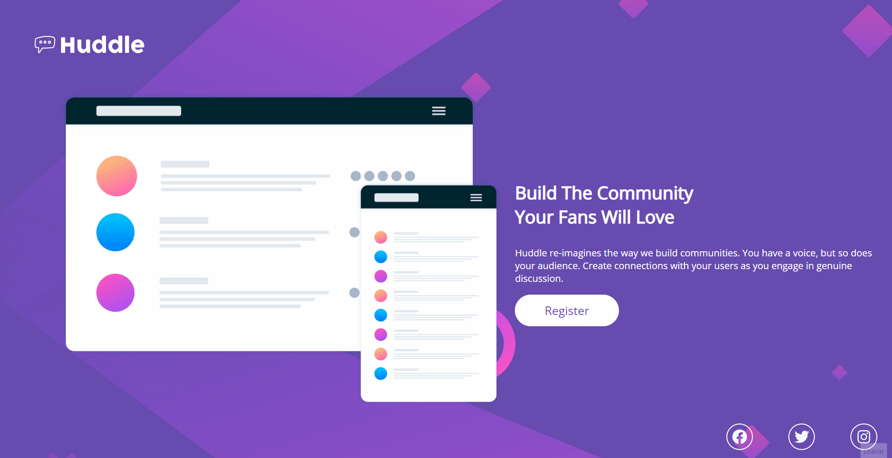

  <h2 align="center">Quest HTML + CSS avançado</h2>

  

    O projeto em questão foi um desafio estimulante no qual os instrutores forneceram orientações para sua realização. Trabalhei de forma independente, submetendo o projeto para avaliação posterior. Enfrentei obstáculos que me incentivaram a encontrar soluções criativas e a me dedicar intensamente. A importância dos ajustes feitos ao projeto para meu aprendizado ficou evidente, demonstrando minha capacidade de adaptação e aprimoramento. Essa experiência resultou em crescimento, autodescoberta e no desenvolvimento de habilidades valiosas.
     
    <a href="https://moniquecarvalho.github.io/quest-html-css-avancado/"><strong>Visualizar o projeto »</strong></a>
     
     
  

  
<b>Versão Web

  
  

    
    

## ☕ Como Usar
Você pode visualizar a página abrindo o arquivo `index.html` em um navegador da web. Certifique-se de que todos os arquivos CSS, imagens e fontes estejam na mesma pasta ou diretório.
 
 

## 📂 Estrutura do Projeto

- `index.html`: O arquivo principal que contém o conteúdo da página.
- `src/css/`: A pasta que contém os arquivos CSS para estilizar a página.
- `src/images/`: A pasta que contém imagens usadas na página.
- `src/fonts/`: A pasta que contém arquivos de fonte utilizados no projeto.
 

## 🚀  Tecnologias Utilizadas

* HTML
* CSS
 

## 👩🏽‍💻  Autora

Este projeto foi criado com base no curso do DevQuest.
 
 

## 📝  Licença

Este projeto está sob a licença  [Licença MIT](license.md). Você pode obter mais informações sobre a licença no arquivo LICENSE.
 
 
